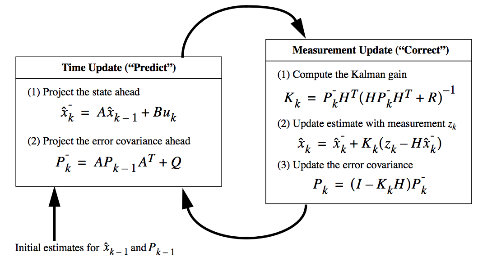

# (APPENDIX) Appendix {-}

# 칼만필터링 A 

경제분석에서는 직접 관측이 불가능한 개념적 변수를 관측 가능한 관련 자료로부터 추출하고자 하는 경우 상태공간모형(state space model)을 활용한다. 상태공간모형은 비관측변수인 상태변수($x_k$)와 관측변수($z_k$)간의 관계를 표시하는 관측방정식과 비관측 상태변수의 전이(transition)과정을 나타내는 상태방정식으로 구성된다[@Harvey2001]. 본 연구에서는 개별 아파트단지의 평형별 아파트의 월별 평균 가격수준을 직접 관측이 불가능한 변수라고 가정한다. 한편 관측가능한 자료인 해당(특정 단지, 특정 평형) 아파트의 월별 평균 실거래 가격은 해당 아파트의 평균적인 가격수준과 실제 거래된 아파트의 특성요인(남향여부, 층수, 인테리어 등) 및 오차항으로 구성된다고 가정한다.

상태방정식 :
\begin{equation}
x_k = Ax_{k-1} + Bu_k + w_{k-1}
(\#eq:binom)
\end{equation}

관측방정식 : 
\begin{equation}
z_k = H x_k + v_k
(\#eq:1)
\end{equation}

\begin{equation*}
w_k \sim N(0, Q)
\end{equation*}

\begin{equation*}
v_k \sim N(0, R)
\end{equation*}


식 (1)와 식 (2)에서 $A$, $B$, $H$는 각각 상태변수내 전이과정, 추가적인 독립변수와 상태변수간 관계, 관측변수와 상태변수간 관계를 나타내는 변수(행렬)이다. $w_k$와 $v_k$는 각각 process 및 measurement noise를 의미하며 서로 독립적이며 정규분포를 따른다고 가정한다^[연구목적에 따라 $A$, $B$, $H$ 변수(행렬)와 $w$, $v$의 조건부 분산인 $Q$와 $R$이 시간에 따라 변한다고 가정하기도 한다.].
한편 $\hat{x^-_k}$을 $k$시점 이전의 모든 정보를 바탕으로 $k$시점의 상태변수값을 추정한 사전추정치(priori state), $\hat{x^-_k}$를 관측변수 측정값($z_k$)를 포함하여 $k$시점의 상태변수값을 추정한 사후추정치(posteriori state)라고 할 때 사전·사후 추정오차($e^-_k$, $e_k$)와 관련 공분산($P^-_k$, $P_k$)은 아래와 같이 정의된다.

사전 추정오차 및 공분산 :
$$ $$
사후 추정오차 및 공분산 : 
$$ $$

상태공간모형의 추정은 주로 칼만필터 알고리즘(Kalman, 1960)을 활용한다^[칼만필터는 과거의 측정데이터와 새로운 측정데이터를 사용하여 데이터에 포함된 노이즈를 제거시켜 보다 개선된 새로운 추정을 하는 알고리즘으로 현재 모든 스마트폰과 네이게이션 기기 등 과학분야에서 널리 활용되고 있다.]. 칼민필터는 상태변수의 사후추정치($\hat{x_k}$)를 사전추정치($\hat{x^-_k}$)와 관측변수의 측정오차($Z_k - H \hat{x^-_k}$, measurement innovation or residual)간 선형결합으로 표현하는 아래의 식 (5)과 같은 최적의 칼만방정식을 도출함으로써 상태변수의 사후추정치($\hat{x_k}$)을 추정한다.

$$ $$

여기서 칼만방정식은 사후 추정오차의 공분산($P_k = E(e_k e^T_k)$)을 최소화하는 최적의 $K$값을 도출함으로써 구할 수 있으며 이를 Kalman gain이라고 한다. @Maybeck1979, @Jacobs1993, @Brown1992은 칼만방정식의 최적 $K$값과 예측오차공분산($P_k$)을 다음과 같이 도출하였다.

$$ $$
$$ $$

결과적으로 사후추정치들은 사전추정치의 예측과정(time update)과 새로운 관측치를 반영하는 수정과정(measurement update)을 반복하면서 추정된다. 여기서 Kalman gain은 사후추정치 계산할 때 사전추정치와 새로운 관측변수를 반영한 측정오차간의 최적 가중치를 의미한다. 즉 칼만필터는 사전추정치와 새로운 관측변수의 예측오차를 사후적으로 비교하여 더 정확한 변수에 더 높은 가중치를 계속 부여함으로써 사후예측결과를 계속 개선하는 알고리즘이라고 할 수 있다. 아래 <그림 1>은 칼만필터 알고리즘의 추정방법을 보여준다^[상태공간모형과 칼만필터링 기법에 대한 보다 자세한 내용은 @Harvey2001, @WelchBishop2001 등을 참조할 수 있다.].


```{r kalman-figure, fig.asp=.7, fig.width=6, fig.cap='칼만필터 알고리즘 추정방법 (Welchand Bishop, 2001)', fig.align='center', out.width='90%'}

```
