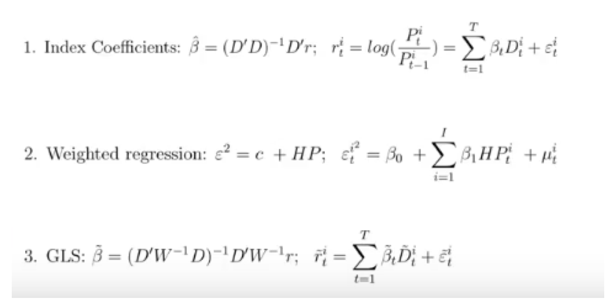

# 이론 및 선행연구 고찰{#literature}

## 이론 고찰

  경제학원론에서 재화의 가격과 거래량은 수요와 공급에 의해 주로 결정되는 내생변수로 본다. 즉 모든 재화는 이를 둘러싼 경제전반의 외생요인 변화에 따라 수요와 공급 여건이 변하게 되며 이로 인한 시장의 불균형 발생과 균형으로의 회귀가 반복되는 과정에서 가격과 거래량이 상호 연관되어 변하게 된다. 경제주체들은 합리적인 경제활동을 영위하기 위해 이러한 가격과 거래량의 움직임을 정확히 측정하고 예측하기 위해 노력하고 있다. 시장에서 거래되는 모든 재화는 이론적으로 가격이 존재하지만 개별 재화의 가격을 가격지수^[가격지수란 특정 재화의 가격을 특정 시점을 기준으로 지수화한 수치를 의미한다. 만약 사과 1개의 가격이 기준년도에 1000원이었는데 현재 1400원이라면 가격지수는 기준년도의 가격을 100으로 보아 140이 된다.]로 산출하는 것은 쉬운 일이 아니다. 특정 재화에 대한 합리적이고 정확한 가격지수를 산출하기 위해서는 우선 해당 재화에 대한 잠재적인 수요와 공급이 풍부하게 존재하고 많은 거래량이 꾸준하게 발생하여야 한다. 또한 모든 거래정보가 집중되고 공개되어야 한다. 그러나 이러한 경우는 경제학에서 이론적으로 가정하는 완전경쟁시장^[ 다수의 수요자와 공급자, 재화의 동질성, 자유로운 진입과 퇴거, 완전한 정보(가격, 거래량, 재화정보 포함)]에서나 가능하며 현실 경제에는 이러한 재화는 매우 이례적이 경우에나 존재한다. 이러한 이유로 모든 통계기관들은 가격지수를 산출하는 과정에서 다양한 추론방법과 가정을 활용하고 있다. 대표적인 가격지수의 예로는 소비자물가지수, 국제원유가격, 주가지수, 부동산가격지수 등이 있다. 각 가격지수 유형별로 지수산정시 어려움과 해결방안을 살펴보면 다음과 같다.
  첫째, 소비자물가지수와 같이 다양한 상품군의 가격지수를 산출하는 경우 대상 상품군의 선택, 각 상품이 가격지수에서 차지하는 비중(sample selection), 각 상품가격으로부터 전체 상품군의 가격으로의 합산방식(aggregation), 각 상품별 가격측정방식 등과 관련하여 추가적인 정보와 의사결정이 필요하다. 물가지수의 경우 각국의 통계당국이 각국의 상황에 맞추어 결정한 편제방식으로 추정하고 있으며, 국제적으로 표준화하기 위해 ..에서 매뉴얼을 만들어 제공하고 있다.
 둘째, 국제원유가격과 같이 대상자산이 한 가지인 경우에도 재화의 동일성 유지와 거래정보를 입수하는데 어려움이 있을 수 있다. 원유는 화학적 구성의 차이로 그 품질이 시기별, 지역별로 모두 다르며 전세계에 걸쳐 다양한 가공단계에서 거래되는 원유의 가격과 거래량을 모두 취합하여 가격지수를 산출하는 것은 사실상 불가능하기 때문이다. 이러한 문제를 해결하기 위해 원유의 성분 등을 고려하여 품질등급을 사전에 정해두거나 지역별로 시장을 분할하여 가격지수를 산출할 수 있다. 국제원유시장에서는 두바이와 WTI 유가가 이러한 이유로 서로 다른 가격지수로 산출되어 거래되고 있다. 
  셋째, 엄격하게 조직화된 금융시장에서 거래되는 주식

둘째, 주가지수와 같이 금융자산의 가격
- 거래정보가 완전 공개, 품질이 동일 -> 경제학에서 가정한 완전경쟁시장과 가장 유사
- 자산가격변화에 대한 기대
- 공시제도 등 엄격한 제한. 
- 상장된 주식만(대상 제한) 전체주식이 불과 %  ....   

넷째, 부동산시장 그러나 주식시장과 같이 조직화된 시장이 존재하지 않는 경우
- 어려운 이유   
주택가격 산정이 어려운 이유 : 타 상품에 비해 개별성이 강한 반면 거래량은 매우 부족
-> 동일한 주택이 거래되는 사례가 거의 없음, 거래정보와 주택정보를 매번 아는 것이 어려움


- 통계적 추론방법에 주로 의존.
- 대상이 모호 -> 실무적 활용이 어려움
- 목적, 샘플편의 방대한 정보 필요
- 그러나 개인 부에서 차지하는 비중이 가장 큰 자산
- 보다 실물적으로 활용가능한 지수 필요(소비자물가지수 연금 등, 주가지수 연계상품....)
최근 국제기구 등에서 연구가 활발

주요 요건 정의 ....다양성, 실무에 적용가능한 지수


시장에서 거래되는 모든 상품은 통상적으로 가격이 존재하며 특정 상품군의 가격지수가격이 존재하며 세상에 존재하는 모든 재화는 이론적으로 특정 상품군의 가격지수를 편제하는 일은 생각보다   
개별상품의 가격은 각기 특수한 수요·공급의 사정에 따라 그 변동의 크기와 방향이 일정하지 않다. 두 시점 사이에서 한 상품의 가격은 등귀(騰貴)하나 다른 상품의 가격은 하락하는 경우도 있으며, 같은 방향으로 등락하는 경우라도 반드시 같은 비율로 변화하는 것은 아니다. 따라서 국민경제 전체의 물가변동을 관찰하기 위해서는 가격지수가 아니라 물가지수가 이용된다.


주택은 가계, 국가차원에서 가장 중요한 자산중이 하나. 그러나 주택이 가격지수를 추정하는 일은 매우 어려운 일. 이는 부동산의 경우 개별성이 강하고 거래가 많지 않은 데다 주택가격지수를 추정하는데 필요한 정보도 충분하지 않은 경우가 대부분이기 때문이다. 이에 따라 주택가격지수를 추정하려는 노력이 국내외적으로 활발히 진행중

주택가격지수 추정에 관한 연구는 크게 3가지 측면에서 활발히 이루어지고 있다. 

첫째, 정확한 주택시장의 흐름을 이해하기 위해 

가 보유하는 자산중 그 비중이 가장 큰 자산, 국가차원에서는 적으로 보더라도 매우 중요한 자산이다. 이며 국가계가 보유하고 있는 자산 중 80% 이상이 부동산이며 이중 절대적개인과 국가가 가지는 전체 총자산 중 주택이 차지하는 비중은 절대적으로 크다. (부)부중 의 부에서 차지하는 비중이 절대적으로 크주택가격지수는 


##  선행연구 고찰

순수한 가격변화 추정을 위한 고려사항 

  - Quality Mix change
    - 개별주택의 속성은 변함.(주택개량, replacement, 증축, depreciation)
    - Compostional change : 거래된 주택의 구성이 시기별로 변함(경기침체기에 대형주택 거래 감소)
  - major characteristics : 주택면적, 토지면적, location, age, type of structure, material used, 방수, 화장실수, 창고, 수영장, 에어컨, 편의시설

  - 주택 특징 변화를 control하는 방법 : stratification or mix adjustment, repeat sales mothds, hedonic regression method, use of property assessment information 

### 헤도닉 지수(Hedonic Price Index)

헤도닉가격지수는 시장에서 거래된 주택의 거래가격을 종속변수로 하고 주택가격에 영향을 미치는 여러 특성^[국내 선행연구에서는 대지면적, 층수, 준공연수 등의 구조특성 변수, 지하철역과의 거리, 도심으로부터의 거리, 접면도로의 폭 등의 입지특성 변수, (임대료를 추정하는 모형에서의) 임대기간, 입주자의 신용도 등의 계약 특성변수 등을 사용하고 있다.(@Lee2008, 김명준 외 2008, 박헌수 2009) (location, type, age, floor space, plot area만으로 충분히 설명)]과 기간더미를 설명변수로 설정한 회귀모형을 통해 주택의 특성변화 따른 가격변화를 제외한 ‘질적으로 동일한 주택’의 순수한 가격변화를 추정하는 방법이다(Rosen, 1974).


\begin{equation}
ln P = \alpha +  \sum_{i=1}^{k}\beta lnX_i + \sum_{i=2}^{T} \gamma_i D_i + \epsilon  (\#eq:1)
\end{equation}

\begin{equation*}
P : 주택 실거래가격
\end{equation*}

\begin{equation*}
X_i : 해당 주택의 특성벡터
\end{equation*}

\begin{equation*}
D_i : 월별 더미변수
\end{equation*}


헤도닉 회귀분석은 주택의 질적 변화, 표본선택 편의를 고려할 수 있다는 장점이 있으나 주택의 특성요인 정보 등 많은 데이터를 필요(data-intensive)로 하며 주택의 위치를 통제할 수 없다는 단점이 있다. 동 방법은 미국상무부 통계청의 신규단독주택가격지수와 영국통계청의 주택가격지수, 프랑스에서는 전지역의 주택특성가격지수 작성시 활용되고 있으며 주택의 질적 변화를 통제할 수 있는 가장 이상적인 가격지수 추정방식으로 평가되어 학계에서 많이 활용되고 있다. 


### 가중평균가격지수(Stratification or Mix Adjustment Methods)

 가중평균가격지수는 주택을 위치, 규모, 종류, 노후도 등 유형별로 세분화하여 각 그룹의 단위면적당 평균가격 또는 중앙값^[CPI Manual(2004)에서는 주택가격의 positively skewed된 경우가 많아 mean보다 중위값이 많이 사용unit price 중위가격을 사용토록 권고]을 산출한 후 이를 다시 거래량 또는 주택수(stock)를 기준으로 가중평균하여 주택가격지수를 추정하는 방법이다(CPI Manual, 2004)^[이러한 ‘stratification and re-weighting’ 방법은 표본데이터를 가지고 분석하는 경우 표본선택편의(sample selection bias), 미응답(non-response) 등에 따른 문제를 해결하는 일반적인 방법론이다.]. 동 방식은 주택의 유형별, 지역별 가격지수를 쉽게 산출할 수 있는 데다 주택의 그룹을 잘 정할 경우 매 기간 거래된 주택의 구성이 달라져도 각 그룹의 관측치 수만 달라지고 평균가격은 크게 영향받지 않는 장점이 있다. 다만 주택의 그룹구분이 적정하지 못하거나 너무 세분된 경우에는 표본선택 또는 단위가격 편의, 표본부족에 따른 높은 가격변동성 문제 등이 발생할 수 있는 단점이 있다. CPI Manual(2004)은 동 방법 활용시 각 계층의 평균값은 단위면적가격(unit value)의 중위값을 사용하고, 합산은 연쇄가중 피셔가격지수(chained Fisher index)를 사용할 것을 권고하고 있다. 
 
 Laspeyres price index
 
 $$ $$
 
 동 방법은 영국 환경부(1982)와 호주 통계청(ABS, 2006) 등 일부기관에서 주택가격지수 편제방법으로 활용하고 있으나 학계에서는 여타 방법론과의 비교목적으로 주로 활용되고 있다^[Mar and Goldberg(1984), Crone and Voith(1992), Gatzlaff and Ling(1994), Wang and Zorn(1997) 등]. 
 
### 반복매매지수(Repeat Sales Price Index)

반복매매지수는 전체 지수산정 기간중 2번 이상 거래된 동일주택의 반복매매거래쌍 자료(주소, 매매가격, 거래일 등)로부터 해당기간 가격상승율을 기간 더미변수에 대해 회귀분석하여 주택가격지수를 산출하는 방법이다(Baiiley, Muth & Nourse, 1963).
동 방법은 동일주택의 반복매매거래쌍 정보만을 이용하므로 주택의 위치정보를 자동으로 통제하며 데이터의 수집부담이 적어(less data-intensive) 실무적으로 이용하기 용이하다. 다만 주택거래량이 많지 않은 경우 표본선택편의가 발생하고 주택의 질적 변화를 고려하기 어렵다. 또한 .전체 주택거래자료 중 두 번 이상 거래된 주택거래자료만 이용하므로 데이터 이용의 효율성이 낮다는 단점이 있다. 
....에서 활용중. 특히 Case & Shiller(1987, 1989)는 각 반복매매거래쌍의 거래일간 간격이 길어질수록 주택가격의 변동성이 커지는 이분산(Heteroscadacity) 문제를 해결할 수 있는 가중회귀분석(Weighted Least Square) 방법론을 제시하였다. 동 Case-shiller지수는 미국의 대표적인 주택가격지수로 발전하여 최근에는 이에 기초한 선물상품이 도입되어 거래되고 있다.


```r

```

<div class="figure" style="text-align: center">

<p class="caption">(\#fig:Case-Shiller)Case-Shiller Index</p>
</div>
### 평가가격기반 지수


### 상태공간모형 기반

 최근의 주택가격지수 추정에는 주택거래에서 실제로 관측되는 거래가격에 내재한 오차(transaction noise)를 제외한 주택가격지수를 산출하려는 목적에서 주택의 시장가격을 잠재변수(latent variable)로 설정하는 상태공간모형을 접목한 연구들이 로 설정하여 가격지수를 추정하는 상통제하여 주택의 시장가격을 추정하려는  
     2. latant variable : selling prices do not always exactly represent the market values of the properties, which can be viewed as a latent variable. 
                        -> transaction noise involved that causes volatility of the measured price indices.

주택가격지수 추정에 상태공간모형을 접목한 연구들은 흔치 않다. Schulz and Werwatz(2004)는 1982~1999년 기간 동안 독일 베를린 남서부 4개 지역의 실거래가 자료에 기초하여 기존의 헤도닉가격 함수를 이용하여 주택가격 움직임의 공통 요인(common price component)을 찾고 이를 통해 주택가격지수를 산출하는 방법이 가지고 있는 한계를 극복하기 위해 상태공간모형을 이용하였다. 그들은 자산가격결정에 대한 이론적 모형을 통해 특정 주택의 가격과 기준 주택 가격의 차이가 해당 주택이 가지고 있는 특성뿐 아니라 해당 주택의 기대수익률에 의존함을 제시하고 주택가격과 기대수익률 결정요인을 동시에 추정하는 과정에서 시점별로 거래빈도가 서로 다른 문제를 극복하기 위해 상태공간모형을 이용하였다. 국내에서는 박헌수·유은영(2014)이 거래빈도가 낮거나 거래가 없는 하위 시장을 대상으로 상태공간모형을 활용하여 실거래가격지수를 개발하고, 이를 반복매매모형에 기초한 실거래가격지수와 비교 분석한 바 있다.
이러한 선행연구들은 시점별로 거래빈도가 서로 다른 경우 발생할 수 있는 문제를 중심으로 상태공간모형을 이용하여 주택가격지수를 개선하는 것을 목적으로 하였기 때문에 관련 자료를 지역별로 통합하여 이용하였다.
    


