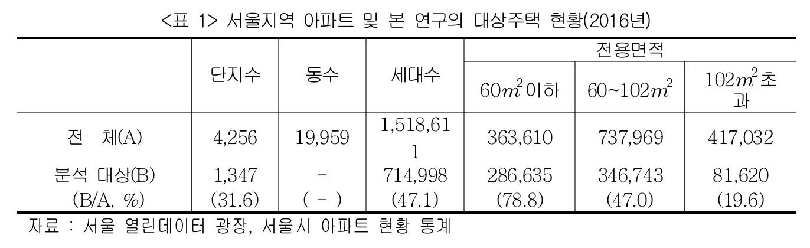
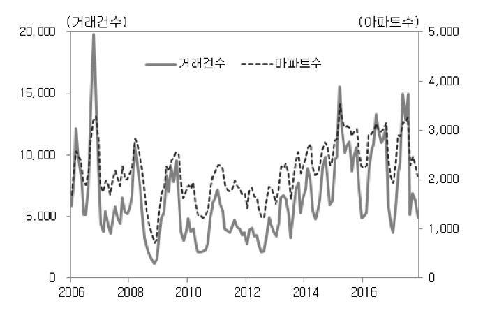

# 밴치마크 아파트가격지수 추정방법 {#method}

## 개 괄

본 연구에서는 기존 주택가격지수가 가지는 ... 등의 문제를 개선하고 실무적으로 쉽게 적용할 수 있는 실거래가 기반의 개별 아파트 평균매매가격 및 다양한 유형 그룹별 아파트 가격지수를 체계적으로 추정할 수 있는 새로운 방법론을 제시하고자 한다.
특징 : 샘플대상 주택별로 월별 가격지수 산출, 시장성이 있는 주택을 대상
이를 위해 본 연구에서는 ...만을 분석대상으로 하였다. 

 본 연구에서는 다음과 같이 3단계에 걸쳐 새로운 아파트가격지수를 추정한다. 
1단계에서는 국내 선행연구에서 반복매매지수 추정방법 적용시 사용하는 동일주택(동일단지, 동일평형, 동일층 아파트) 개념을 일부 완화하여 동일주택군(동일단지, 동일평형 아파트)이라는 개념을 도입하고 동일주택군별 월별 평균매매가격(중위값)을 추정한다. 
이 경우 동일주택군내 반복매매거래쌍 자료가 크게 증가하는 장점이 있으나 분석대상 아파트의 동일성이 약화되어 실거래가격에 오차(transaction noise)가 증가하는 단점이 있다. 이에 2단계에서는 동일주택 개념 확대로 발생하는 측정오차를 통제하는 한편 동일주택군 내에서 주택거래가 한 건도 발생하지 않는 경우 발생하는 누락치를 추정(imputation)하는 방법으로 상태공간모형과 칼만필터링기법을 활용하였다. 이를 통해 전체 동일주택군의 평균매매가격을 매월 누락없이 추정하는 것이 가능하다. 3단계에서는 기존 선행연구에서 활용하는 다양한 합산방법을 활용하여 동일주택군별 주택가격에서 시장성이 있고 밴치마크로 활용가능한 서울지역 아파트가격지수와 다양한 유형그룹별 주택가격지수를 추정하였다.  


##  [1단계] 동일주택군 선정 및 실거래 중위가격 추정

주택가격지수는 기본적으로 일정기간중 동일한 주택의 가격변화를 측정하는 것을 목적으로 한다. 그러나 주택시장은 개별성이 강하고 거래량이 매우 제한적이어서 현실적으로 동일한 주택의 가격변화를 측정할 수 있는 자료가 매우 제한적이다. 이를 감안하여 대부분의 주택가격지수 추정방법들은 동일주택의 가격변화 관련 기초자료 확보 또는 유형별 주택그룹 구분 등을 위해 동일주택에 대한 가정과 통계적 추론방법을 사용한다. 국내 아파트의 경우 단독주택, 연립주택 등과 달리 주택의 특성이 비교적 표준화되어 있는 데다 동일단지 아파트간 유사성 정도가 높아 동일주택 그룹 구분이 상대적으로 용이하고 명확한 편이다. 기존 선행연구와 국토교통부의 실거래가 지수 산정시에는 “동일 단지, 동일 평형, 동일 층인 아파트”를 동일주택으로 가정하여 지수를 산출하고 있다. 이 경우 아파트들을 작게는 몇 세대에서 많게는 몇 십 세대까지 동일주택 그룹을 묶는 것이 가능하고 동일주택내 반복매매거래쌍도 제한적으로 확보할 수 있어 행정구역단위의 주택가격지수 산출이 가능해진다. 
실제로 선행연구의 동일주택 가정과 국토교통부가 제공하는 2006~2017년중 서울지역 아파트 실거래 매매자료를 활용하여 분석해본 결과, 동 기간중 매매건수는 총 928,325건, 거래실적이 있는 아파트는 총 8403단지^[국토교통부가 공개하는 자료의 주소지를 기준으로 구분]로 나타났으며 동일주택은 총 몇 개로 조사되었다. 이중 월별로 실제 주택거래가 발생한 아파트는 단지기준으로는 평균 %, 동일주택 기준으로는 %에 불과


그러나 개별 동일주택의 가격지수를 추정하고 이를 활용하여 다양한 유형별 주택가격지수를 추정하는 것은 여전히 불가능하다. 매월 거래되는 아파트가 달라지므로 샘플링 문제도 존재.
  본 연구에서는 동일주택 가정을 보다 완화하여 “동일 단지, 동일 평형 아파트”를 “동일주택군”이라고 가정하고 국토교통부에서 제공하는 아파트 실거래 상세자료와 다음부동산의 아파트 단지별 정보를 활용하여 동일주택군을 다음과 같이 도출하였다.
동일주택군의 아파트 세대수가 최소 150세대 이상되는 대형 아파트단지를 분석대상으로 제한하였다. 이를 통해 동일주택군의 주택실거래가 적어도 분기에 한 번 이상은 나올 수 있도록 하였다. 
  동일주택군은 기존 선행연구에서 분류한 세부기준으로는 몇 개, 본 연구의 기준으로는 몇 개로 나왔다.
  
  은 총 몇 개가 나온다. 그러나 이 경우에도 동일주택군에서 매월 주택거래가 발생하기는 어렵기 때문에 거래가 전혀 발생하지 않는 월이 많이 발생하게 되므로 매월 가격지수를 산출하는 것은 여전히 어렵다.

그러나 세대수가 많은 대형 아파트 단지의 경우에는 전체 샘플기간(144개월)중에 일부 누탁치를 외에는 대부분 매월 거래가 발생하고 있음. 이에 본 연구에서의 대상주택은 동일주택군을 대상주택수가 150세대 이상이고 월평균 거래수가 0.5 이상인 아파트로 가정. 이에 해당하는 동일주택군은 총 3000개. 서울 아파트의 대상 동일주택군은 세대수가150~1000세대까지 분포. 지역별로보면.

[그림]전체 주택 분포에서 동일주택군 분포 
  
동일주택에 대한 가정에 따라 동일주택의 수를 비교하면 다음과 같음
동일주택군 기준으로 보면 층구분시와 미구분시 전체 동일주택군 수는 몇 개, 월평균 거래건수는 건으로 큰 차이 
층 미구분시 동일주택의 거래분포는 다음과 같다.
동 기간중 월평균 거래건수는 6492건, 실제 거래실적이 있는 아파트 단지는 평균 2186개 정도이며 나머지 6천개 단지는 전혀 거래가 발생하지 않는다. 즉 월별로 보면 전체 아파트중 25%만이 거래가 발생하고 거래건수는 아파트별 월평균 3건 정도에 불과


```r

```

<div class="figure" style="text-align: center">

<p class="caption">(\#fig:apt-number)서울지역 아파트 및 본 연구의 대상주택 현황(2016년)</p>
</div>


```r

```

<div class="figure" style="text-align: center">

<p class="caption">(\#fig:apt-number2)월평실거래가수 및 아파트수</p>
</div>

대상 동일주택군이 선정되었다는 것을 전제로 실거래가 자료를 기준으로 3천개 동일주택군의 중위가격은 개별 동일주택군별로 월별 중위가격을 사용하여 산출. 선행연구에서 중위가격이 우수하다고 증명. 

국내 아파트의 실거래가지수를 연구한 선행연구와 국토교통부의 실거래가지수는 국내 아파트시장의 특성을 감안하여 동일단지, 동일평형, 동일층 아파트를 유사 아파트로 가정하고 해당지역내 유사 아파트의 반복매매거래쌍 자료를 활용하여 행정구역별 아파트가격지수를 산출하고 있다. 본 연구에서는 행정구역보다 세분된 아파트별 월평균 매매가격^[해당 월에 두 건 이상의 유사 아파트 거래가 있는 경우 중위값을 사용하여 월별 평균가격을 산출하였다.]을 추정하기 위해 유사 아파트 가정을 동일단지, 동일평형으로 완화하였다. 이 경우 유사 아파트의 반복매매거래쌍 자료가 큰 폭으로 증가하는 장점이 있으나 유사 아파트의 동질성이 약화되어 실거래가격에 오차(transaction noise)가 증가하는 단점이있다. 이에 본 연구에서는 실제 관측되는 유사 아파트의 거래가격과 별도로 동일주택의 거래가격을 잠재변수로 가정하는 상태공간모형을 설정하고 칼만필터링 기법을 적용하여 측정오차를 필터링하여 잠재변수인 동일 주택의 거래가격을 추정하였다.^[선행연구에서는 유사 아파트내 조망권, 남향여부 등의 차이에 따른 거래가격의 측정오차를 전혀 고려하지 않고 있으나 동 연구에서는 유사 아파트의 이러한 추가적인 특성요인과 층에 따른 거래가격 차이를 측정오차로 가정하여 필터링함으로써 이를 통제하고 있다.]

본 연구에서는 기존 주택가격지수 추정방법론인 가중평균가격지수, 반복매매지수과 상태공간모형과 칼만필터링 기법을 활용하여 밴치마크 아파트가겨지수 추정방법을 제시하고자 한다. 1단계에서는 표본편의를 제거하기 위해 동일주택군을 선택. 우리나라의 아파트시장은 표준화되어 있어 동일주택군을 선택하기가 비교적 용이.   

-> 대부분의 통계편제 기관들은 제한된 거래정보로 쉽게 가격지수를 편제할 수 있는 반복매매기법을 많이 활용. 실무적으로는 일정한 속성(지역, 크기, 주택유형 등)이 같은 주택군을 동일주택으로 가정하고 경우 동일주택의 반복매매쌍 정보를 활용하여 주택가격지수를 산출
동일주택으로 분류되는 주택의 수가 늘어나면 자연히 더 많은 반복매매쌍이 존재 -> 정기적으로 가격지수 산출이 가능해짐


본 연구에서는 동일주택 가정을 보다 완화하여 동일 단지, 동일 평형 아파트를 동일주택으로 가정하였다. 이로써 동일주택의 수를 150~1000세대까지 확대 가능. 그러나 이 경우에도 동일주택군에서 매월 주택거래가 발생하기는 어렵기 때문에 거래가 전혀 발생하지 않는 월이 많이 발생하게 되므로 매월 가격지수를 산출하는 것은 여전히 어렵다. 아울러 기존 선행연구와 달리 아파트의 층을 고려하지 않았기 때문에 실제 거래금액에 측정오차가 포함되는 문제가 생긴다. 이를 해결하기 위해 상태공간모형과 칼만필터링기법을 활용하여 ... 기법으로 측정오차 및 누탁관측치 문제를 해결가능 . 이를 통해 가격지수 산출의 대상주택군 전체에 대해 매월 평균가격을 도출 가능

일반적인 가격지수 산출시 개별 품목의 가격에서 전체 품목의 가격지수화를 위해 다양한 합산방법((중위가격, 거래량 가중평균, 시가총액 가중평균 등)을 사용

## [2단계] 동일주택군별 평균 주택가격 추정


동 중위가격에는 해당 동일아파트군내 개별아파트의 특성차이(층, 인테리어) 등에 따라 측정오차를 내재
이를 통제하기 위해 본 연구에서는 .. 사용
상태공간모형과 칼만필터링은 ...

여기서는 위에서 구한 동일주택군별 중위가격을 측정오차를 포함하는 측정변수로 보고 실제 평균가격은 보이지 않는 잠재변수로 가정하여 상태공간모형을 설정하고 칼만필터링기법을 활용하여 잠재변수인 동일주택군의 평균가격을 추정
이를 통해 전체 동일주택군에 대해 누락치가 없는 평균가격을 추정가능
위에서 구한 중위가격에 비해 편차가 줄어든 평균가격이 산출. 이를 통해 층, 인테리어등 개별 주택의 특성요인을 체계적으로 통제 가능


상태공간모형, 칼만필터링 (그림으로 설명)


## [3단계] 서울지역 아파트가격지수 추정(합산)

 다음 단계에서는 앞에서 구한 동일주택군별 평균가격을 합산하여 서울지역 아파트가격지수를 추정. 합산방식은 다양한 방법을 사용가능

(시가총액과 거래량 가중평균)
주가지수 등의 산출방법에서 사용하는 시가총액, 거래량 가중평균방식으로 동일 아파트군의 평균가격을 합산

( 반복매매지수 )
미국 ...지수에서 사용한 반복매매기법(3단계 추정)을 활용. 
전체 지수에서 차지하는 동일주택군별 비중은 단순합산, 거래량, 시가총액 가중 평균방식을 다양하게 적용 가능

( 헤도닉모형 적용방안 )
동일주택군의 특성정보를 가지고 있는 경우 동일주택군 3000개를 대상으로 헤도닉모형을 적용 가능. 


## 기존 주택가격지수 추정방법과의 차이

동 연구에서는 이러한 기존 가격지수 산출시 합산방법 외에 주택시장의 대표적인 가격지수 산출방식인 반복매매지수(거래량 또는 세대수 가중회귀), 거래량 또는 시가총액 가중평균 방식으로 합산하여 가격지수를 산출. 이 경우 매기간 모든 대상주택군의 가격이 나오므로 sampling error가 발생하지 않음. 한편 동 방식으로 도출한 개별 주택의 가격을 활용하여 주택의 정보가 확보된다면 헤도닉 방법론으로 적용하는 것도 가능.(추후 논문에서 다룰 예정)

아파트 단지의 평형별 주택을 동의주택의 동일성을 다소 완화하는 대신 측저오차를 상태공간모형과 칼만필터링기법을 활용하여 해결하므로 3000개 아파트 단지의 매월 주택가격을 거래량이 없더라도 추정할 수 있는 방법을 제시. 또한 동 개발 아파트 가격과 해당 아파트 특성정보를 이용하여 헤도닉 모형으로 주택시장의 가격지수를 산출하는 새로운 주택가격지수 산출방법을 제시하였다. 동 주택가격지수는 3천개 아파트 단지의 기초가격을 바탕으로 주택가격지수를 산출하므로 기존 반복매매지수에서 발생했던 sampling Error을 줄일 수 있는 데다 헤도닉 모형읮 장점인 ... 등을 가지고 있어 이론적으로 기존 추정방식에 비해 우수한 기법으로 판단된다. 
이는 한국 주택시장이 아파트라는 특성을 가지고 있는 점에서 가능
  기존지수에 비해 포괄범위 차이

  기존 선행연구에서 상태공간모형 적용 논문과의 차이
  - 반복매매기법, 헤도닉 기법을 보완하는 정도로 최종 단계에서 사용(합산 이후에 한번)
  - 본 논문에서는 동일주택군 평균가격 추정시 각각 사용후 합산(합산전에 각 동일주택군별 단계에서 적용)
  
  
  
  
  
  
  


 


