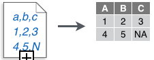
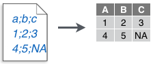
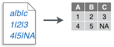
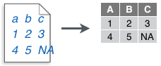
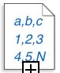
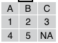
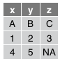
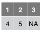
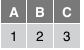
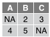

# Data Import


## Basics

readr, tibble, and tidyr

R's tidyverse is built around tidy data stored in tibbles, an enhanced version of a data frame.

* Readr : The front side of this sheet shows how to read text files into R with readr.
* tidyr : The reverse side shows how to create tibbles with tibble and to layout tidy data with tidyr.


## Write Functions

Save x, an R object, to path, a file path, with:

```
These functions share the common arguments:
write_*(x, path, na="NA", append=FALSE, col_names=!append)
```


Table: (\#tab:unnamed-chunk-3)Write functions

func              delim   arguments                          
----------------  ------  -----------------------------------
write_csv         ,                                          
write_delim       any     delim="..."                        
write_excel_csv                                              
write_file                                                   
write_lines                                                  
write_rds                 compress=c("none","gz","bz2","xz") 
write_tsv         tab                                        

## Read Functions

<div class="comment_with_line">
These functions share the common arguments: <br>
<strong>read_*</strong>(file, col_names=TRUE, col_types=NULL, locale=default_locale(),
na=c("","NA"), quoted_na=TRUE, comment="", trim_ws=TRUE, skip=0, 
n_max=inf, guess_max=min(1000, n_max), progress=interative())
</div>

<br>

### Read tabular data tibbles

<div class="grid-container33">
<div class="grid-item"></div>
<div class="grid-item"><span class="tcode">read_csv()</span></div>
<div class="grid-item">Reads comma delimited files</div>
<div class="grid-item"></div>
<div class="grid-item"><span class="tcode">read_csv2()</span></div>
<div class="grid-item">Reads Semi-colon delimited files</div>
<div class="grid-item"></div>
<div class="grid-item"><span class="tcode">read_delim(delim, quote="\", escape_backslash=FALSE, escape_double=TRUE)</span></div>
<div class="grid-item">Reads files with any delimeters</div>
<div class="grid-item"></div>
<div class="grid-item"><span class="tcode">read_fwf(col_positions)</span></div>
<div class="grid-item">Reads fixed width files</div>
<div class="grid-item"></div>
<div class="grid-item"><span class="tcode">read_tsv()</span></div>
<div class="grid-item">Reads tab delimited files</div>
</div>

### Useful arguments

<div class="grid-container">
<div class="grid-item"></div>
<div class="grid-item">

```r
write_csv(path='file.csv',
x = read_csv("a,b,c\n1,2,3\n4,5,NA"))
```
</div>

<div class="grid-item"></div>
<div class="grid-item">

```r
read_csv("file.csv", col_names=FALSE)
```
</div>

<div class="grid-item"></div>
<div class="grid-item">

```r
read_csv("file.csv", col_names=c("x","y","z"))
```
</div>

<div class="grid-item"></div>
<div class="grid-item">

```r
read_csv("file.csv", skip=1)
```
</div>

<div class="grid-item"></div>
<div class="grid-item">

```r
read_csv("file.csv", n_max=1)
```
</div>

<div class="grid-item"></div>
<div class="grid-item">

```r
read_csv("file.csv", na=c("4","5","."))
```
</div>

</div>


## fread() for bigger datasets
- set working directory
- packages "data.table"
- handles large datasets fast
- easy to use
- improved .CSV importing features
    * separator is automatically recognised
    * strings are not automaticall convertied to factors | 'stringsAsFactors=T'
    * the header is displayed automaticall
- output: 'data.frame' (second class: 'data.frame') | 'data.table=F'


```r
library(data.table)
#> 
#> Attaching package: 'data.table'
#> The following objects are masked from 'package:dplyr':
#> 
#>     between, first, last
#> The following object is masked from 'package:purrr':
#> 
#>     transpose
mydata = fread("./data/Bug-Frequency.csv")
mydata
#>          region < 10 g 10 - 20 g 20 - 30 g 30 - 40 g > 40 g
#> 1:  Welsh Creek      5        34        54        23      8
#> 2:    River Inn     72        33        28        35      9
#> 3:  Spur Forest     34        65        23        67      2
#> 4: Hamock Flats     28        23        34        45     11
#> 5:   Gelb Rocks     34        68        23        58      9
```

[World population](https://en.wikipedia.org/wiki/World_population)


```r
df = fread("1	 Singapore	5,612,300	710	7,905
2	 Bangladesh	164,170,000	143,998	1,140
3	 Taiwan	23,562,318	36,190	651
4	 South Korea	51,446,201	99,538	517
5	 Lebanon	6,082,000	10,452	582
6	 Rwanda	11,809,295	26,338	448
7	 Netherlands	17,200,000	41,526	414
8	 Haiti	10,911,819	27,065	403
9	 India	1,329,250,000	3,287,240	404
10	 Israel	8,830,000	22,072	400",
col.names = c("Rank",	"Country","Population",	"Area(km2)","Density(Pop. per km2)"
))

df
#>     Rank     Country    Population Area(km2) Density(Pop. per km2)
#>  1:    1   Singapore     5,612,300       710                 7,905
#>  2:    2  Bangladesh   164,170,000   143,998                 1,140
#>  3:    3      Taiwan    23,562,318    36,190                   651
#>  4:    4 South Korea    51,446,201    99,538                   517
#>  5:    5     Lebanon     6,082,000    10,452                   582
#>  6:    6      Rwanda    11,809,295    26,338                   448
#>  7:    7 Netherlands    17,200,000    41,526                   414
#>  8:    8       Haiti    10,911,819    27,065                   403
#>  9:    9       India 1,329,250,000 3,287,240                   404
#> 10:   10      Israel     8,830,000    22,072                   400
```


## data.frame

- the mainly used object type
- straightforward sttucture
    * one row for each observation
    * one column for each variable
- R offers different data frame classes
    * similar to R's data visualization systems:
        - 'R-base'
        - 'lattice'
        -  'ggplot2'

## Three data frame alternatives
- 'data.frame()' function in 'R-base'
- 'data.table()' function in the package 'data.table'
- 'data_frame()' function in the package 'dplyr'

each of them is suitabl for storing most data - Let's see their specialities


### data.frame

- no external package needed
- straightforward for simple tasks
- strings are stored as factors per default
- data recycling
- row names can be provided


```r
mydf = data.frame(
    a = c("Paul", "Kim","Nora","Sue","Paul","Kim"),
    b = c("A", "B","C","B","B","C"),
    c = rnorm(2)
)
mydf
#>      a b      c
#> 1 Paul A -1.400
#> 2  Kim B  0.255
#> 3 Nora C -1.400
#> 4  Sue B  0.255
#> 5 Paul B -1.400
#> 6  Kim C  0.255

sapply(mydf, class)
#>         a         b         c 
#>  "factor"  "factor" "numeric"
```


### data.table

- quick and easy to code
- start processing time
- great documentation
- second class 'data.frame'
- 'data.table' struction is similar to SQL structure

    * 'nameDT [i, j, by]'
        - 'i' stands for the subset from our 'data.table' we want to work with
        - 'j' is the actual calculation that will be performed in the data subset 'i'
        - the whole calculation is grouped by 'by

- strings are not automatically transfromed to factors
- no custom row names, just row IDs
- if a dataset is too big to be processed, then only the first and last five rows are printed


```r
library(data.table)
mytable = data.frame(
    a = c("Paul", "Kim","Nora","Sue","Paul","Kim"),
    b = c("A", "B","C","B","B","C"),
    c = rnorm(2)
)
mytable
#>      a b        c
#> 1 Paul A -2.43726
#> 2  Kim B -0.00557
#> 3 Nora C -2.43726
#> 4  Sue B -0.00557
#> 5 Paul B -2.43726
#> 6  Kim C -0.00557
```

### data_frame

- requires equals column length
- only columns of length 1 will be recycled
- only the firs couple of rows are displayed in case of large datasets
- second class: 'data.frame'
- stirngs are not automatically transformed to factors
- no custom row names, just row IDs


```r
library(dplyr)
my_df = data.frame(
    a = c("Paul", "Kim","Nora","Sue","Paul","Kim"),
    b = c("A", "B","C","B","B","C"),
    c = rnorm(6)
)
my_df
#>      a b      c
#> 1 Paul A  0.622
#> 2  Kim B  1.148
#> 3 Nora C -1.822
#> 4  Sue B -0.247
#> 5 Paul B -0.244
#> 6  Kim C -0.283
```

### Summary


```r
class(mydf); class(mytable); class(my_df)
#> [1] "data.frame"
#> [1] "data.frame"
#> [1] "data.frame"
```

- it is benefically to use advanced tools for extended data management
- 'data.table' and 'data_frame' have the standard 'data.frame' as second class 


## tibble

### nycflights13

To explore the basic data manipulation verbs of dplyr, we'll use `nycflights13::flights`. This data frame contains all 336,776 flights that departed from New York City in 2013. The data comes from the US [Bureau of Transportation Statistics](http://www.transtats.bts.gov/DatabaseInfo.asp?DB_ID=120&Link=0), and is documented in `?flights`.


```r
library(nycflights13)
flights
#> # A tibble: 336,776 x 19
#>    year month   day dep_time sched_dep_time dep_delay arr_time
#>   <int> <int> <int>    <int>          <int>     <dbl>    <int>
#> 1  2013     1     1      517            515        2.      830
#> 2  2013     1     1      533            529        4.      850
#> 3  2013     1     1      542            540        2.      923
#> 4  2013     1     1      544            545       -1.     1004
#> 5  2013     1     1      554            600       -6.      812
#> 6  2013     1     1      554            558       -4.      740
#> # ... with 3.368e+05 more rows, and 12 more variables:
#> #   sched_arr_time <int>, arr_delay <dbl>, carrier <chr>, flight <int>,
#> #   tailnum <chr>, origin <chr>, dest <chr>, air_time <dbl>,
#> #   distance <dbl>, hour <dbl>, minute <dbl>, time_hour <dttm>
```


> You might notice that this data frame prints a little differently from other data frames you might have used in the past: it only shows the first few rows and all the columns that fit on one screen. (To see the whole dataset, you can run `View(flights)` which will open the dataset in the RStudio viewer). It prints differently because it's a __tibble__. Tibbles are data frames, but slightly tweaked to work better in the tidyverse. For now, you don't need to worry about the differences; we'll come back to tibbles in more detail in [wrangle](#wrangle-intro).
 
> You might also have noticed the row of three (or four) letter abbreviations under the column names. These describe the type of each variable:

> * `int` stands for integers.
> * `dbl` stands for doubles, or real numbers.
> * `chr` stands for character vectors, or strings.
> * `dttm` stands for date-times (a date + a time).
> * `lgl` stands for logical, vectors that contain only `TRUE` or `FALSE`.
> * `fctr` stands for factors, which R uses to represent categorical variables with fixed possible values.
> * `date` stands for dates.


## 'scan()' for small vectors and snippets 


```r
numbers = scan()
# characters = scan(what= "character")
```


## Other types of data

Try one of the following packages to import other types of files.

* haven : SPSS, Stata, and SAS files
* readxl : excel files (.xls and .xlsx)
* DBI : databases
* jsonlite : json
* xml2 : XML
* httr : Web APIs
* rvest : HTML(Web Scraping)

packages 'foreing'
to get help : ?foreign

?Hmisc
